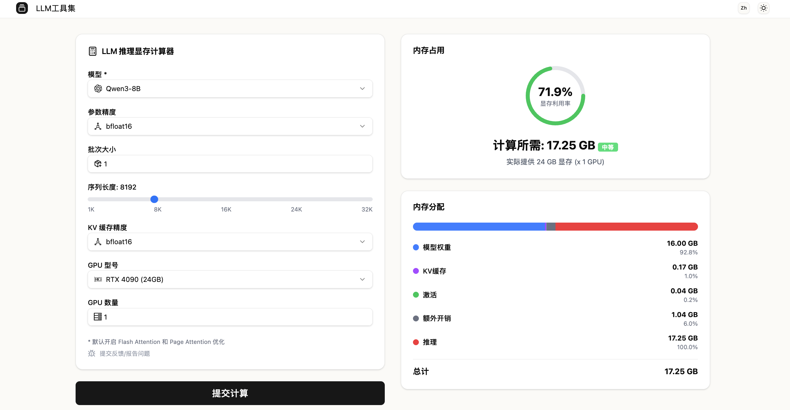

<!-- PROJECT LOGO -->
<br />
<div align="center">
  
  <h3 align="center">LLM 工具集 (LLM Toolset) </h3>
  <p align="center">
    面向大型语言模型 (LLMs) 开发与运维的实用工具集合
    <br />
    <a href="https://github.com/amazingchow/LLMToolset"><strong>探索本项目的文档 »</strong></a>
    <br />
    <br />
    <a href="https://llmtoolset.gocoding.cloud/">在线体验</a>
    ·
    <a href="https://github.com/amazingchow/LLMToolset/issues">报告 Bug</a>
    ·
    <a href="https://github.com/amazingchow/LLMToolset/issues">提出新功能</a>
  </p>
</div>

## 关于本项目

LLM 工具集是一个开源项目，旨在为大型语言模型 (LLMs) 的开发、部署和运维提供一套不可或缺的实用工具。随着 LLM 技术的迅速发展，其在资源消耗和性能优化方面的挑战也日益突出。本项目致力于通过提供一系列精心设计的工具，帮助开发者和研究人员更高效地管理 LLM 生命周期中的关键环节。

我们的目标是简化 LLM 的资源规划、性能分析及日常运维，从而降低 LLM 技术的门槛，加速其在各个领域的应用。

## 主要功能

目前，LLM 工具集提供以下核心功能：

### 内存需求计算器

在 LLM 的训练和推理过程中，准确预估内存需求是优化资源配置和避免 OOM (Out Of Memory) 错误的关键。本计算器提供了一个强大的工具来估算运行或训练大型语言模型所需的内存，其考量因素包括：

*   **模型参数量:** 模型规模的直接体现。
*   **精度:** 如 FP32 (4 字节)、FP16/BF16 (2 字节) 或 INT8 (1 字节)，直接影响模型权重和激活值的存储。
*   **批次大小:** 训练或推理时并行处理的样本数量。
*   **序列长度:** 模型处理的输入或输出文本的最大长度。
*   **优化器状态:** 尤其在训练过程中，优化器（如 Adam, AdamW）会存储额外的状态信息，通常是模型参数的数倍。
*   **梯度:** 训练过程中计算的梯度也需要内存存储。
*   **激活值:** 前向传播过程中产生的中间激活值，在反向传播时需要保留。

**深度指南:**
如需更深入了解 LLM 训练和推理的内存考量，请参阅这篇专业文章：[大型语言模型训练与推理的内存需求](https://medium.com/@manuelescobar-dev/memory-requirements-for-llm-training-and-inference-97e4ab08091b)。

**估算挑战:**
由于框架（如 PyTorch, TensorFlow, JAX）、模型架构（Transformer, Mamba 等）和各种优化技术（如量化、剪枝、梯度累积、ZeRO、DeepSpeed）的复杂性，精确计算 LLM 的内存需求具有挑战性。本工具旨在提供基于关键公式和经验法则的实用估算，帮助用户做出明智的决策。

**经验法则 (Rule of Thumb):**
如果你希望快速获得一个大致估算而不深入细节，可以参考以下简化规则：

*   **推理 (Inference):**
    *   所需内存 ≈ 参数量 × 精度（通常为 2 字节或 4 字节）。
    *   例如，一个 7B 参数的模型，使用 FP16 (2 字节) 进行推理，大约需要 7B * 2 Bytes = 14 GB 内存。
*   **训练 (Training):**
    *   所需内存 ≈ 推理资源的 4 到 6 倍。
    *   这包含了模型参数、优化器状态、梯度和激活值等多个方面的内存开销。

### 免责声明

内存需求计算器是一个用于**估算** LLM 内存需求的工具。由于系统配置、软件版本、特定优化和实际负载的巨大差异，唯一精确估算实际内存消耗的方法是进行实际测试和性能分析。本工具按“原样”提供，不作任何明示或暗示的保证。用户应自行承担使用本工具进行决策的风险。

## 快速开始

要开始使用 LLM 工具集，你可以选择在线体验其功能，或在本地环境中进行设置和运行。

### 在线体验

最简单的方式是直接访问我们的[在线平台](https://llmtoolset.gocoding.cloud/)，你无需安装任何依赖，即可立即使用内存需求计算器。

### 本地部署

如果你希望在本地运行本项目，请遵循以下步骤：

### 环境要求

在开始之前，请确保你的系统满足以下要求：

*   **Git:** 用于克隆代码仓库。
*   **Python 3.10+:** 用于运行后端服务，使用 `uv` 进行依赖管理。
*   **Node.js 18+ (LTS 版本):** 用于运行前端服务。

### 安装步骤

1.  **克隆代码仓库:**

    ```bash
    git clone https://github.com/amazingchow/LLMToolset.git
    ```

2.  **进入项目目录:**

    ```bash
    cd LLMToolset
    ```

3.  **安装并启动后端服务:**

    ```bash
    cd backend
    uv sync         # 安装后端所有依赖
    make local_run  # 启动后端服务
    # 后端默认将在 http://127.0.0.1:15050 运行
    ```

4.  **安装并启动前端服务:**

    ```bash
    cd ../frontend # 返回到项目根目录，然后进入 frontend 目录
    npm install    # 安装前端所有依赖
    npm run dev    # 启动前端服务
    # 前端默认将在 http://localhost:5000 运行 (Next.js 默认端口)
    ```

## 使用指南

成功启动前端和后端服务后，你可以通过浏览器访问前端 URL。

1.  **访问应用:** 打开你的浏览器并导航至 `http://localhost:5000` (或前端启动时显示的地址)。
2.  **使用内存需求计算器:**
    *   在界面上选择模型名称 (例如：Qwen3-8B-Base.json)。
    *   选择数据精度 (例如：float32, float16, bfloat16, int8, int4)。
    *   输入批次大小和序列长度。
    *   点击“计算”按钮，工具将展示估算的内存需求。
    *   根据你的需求，可以在“推理”或“训练”模式之间切换，以获得更准确的估算。

## 开发路线图

我们对 LLM 工具集有宏大的计划。以下是已完成和未来计划的功能：

*   [x] **内存需求计算器:** 提供 LLM 训练和推理的内存估算。
*   [ ] **模型量化工具:** 辅助进行模型量化，以减少内存占用和加速推理。
*   [ ] **性能基准测试模块:** 允许用户对不同硬件和配置下的 LLM 性能进行基准测试。
*   [ ] **成本估算器:** 预测运行或训练 LLM 所需的云资源成本。
*   [ ] **交互式可视化面板:** 更直观地展示资源使用情况和性能指标。

## 贡献

我们非常欢迎社区对 LLM 工具集做出贡献！无论是提交 Bug 报告、提出新功能建议，还是直接贡献代码，你的参与都将使本项目变得更好。

请在贡献前阅读我们的 [CONTRIBUTING.md](CONTRIBUTING.md) 文件，了解详细的贡献指南。

## 许可证

本项目采用 MIT 许可证。更多详情请查阅 [LICENSE](LICENSE) 文件。
