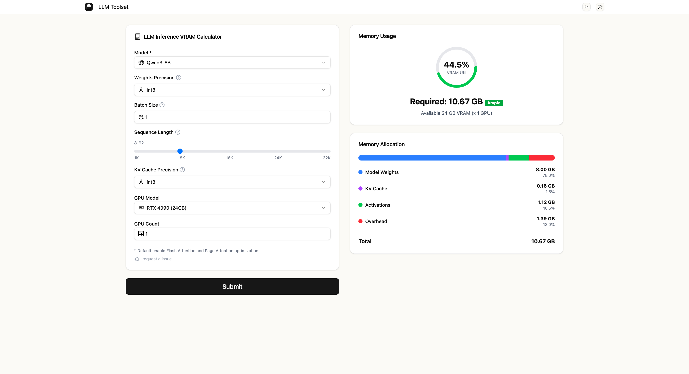

<div align="center">
  

  # 🛠️ LLM Toolset

  **Lightweight Resource Planning Tools for LLM Developers and Researchers**

  [](https://opensource.org/licenses/MIT)
  [](https://www.python.org/downloads/)
  [](https://nodejs.org/)

  [Live Demo](https://llmtool.amazingz.cloud/) · [Report Bug](https://github.com/amazingchow/LLMToolset/issues) · [Request Feature](https://github.com/amazingchow/LLMToolset/issues)
</div>

---

## ✨ Why LLM Toolset?

What's the biggest headache when training or deploying a large language model? **OOM (Out of Memory)**.

This project provides precise memory requirement estimation tools to help you:
- ⚡ **Avoid Resource Waste** - Accurately estimate VRAM needs, no more over-provisioning
- 🎯 **Quick Decision Making** - Rapidly determine if a model can run on existing hardware
- 💰 **Cost Optimization** - Properly plan GPU resources and reduce cloud service costs
- 📊 **Multi-Scenario Support** - Cover training, inference, quantization, and more

## 🎯 Core Features

- **Precise Memory Estimation** - Accurate calculation based on model architecture, precision, batch size, and other parameters
- **Multi-Precision Support** - Full coverage of FP32, FP16, BF16, INT8, INT4
- **Training & Inference Modes** - Separate calculations for different scenarios
- **Optimizer State Calculation** - Includes additional overhead from optimizers like Adam, AdamW
- **Activation Estimation** - Considers intermediate activations in forward propagation
- **Visual Display** - Clear charts showing memory distribution

## 🚀 Tech Stack

**Backend**
- Python 3.10+ (managed with `uv`)
- Flask / FastAPI
- Scientific computing libraries (NumPy, etc.)

**Frontend**
- Next.js 14+
- React 18+
- TypeScript
- Tailwind CSS

## 📖 Usage Examples

### Quick Estimation (Rules of Thumb)

For rough estimates, use these rules:

| Scenario | Formula | Example |
|----------|---------|---------|
| **Inference** | `Memory ≈ Parameters × Precision` | 7B model × FP16 (2 bytes) ≈ 14GB |
| **Training** | `Memory ≈ Inference Memory × 4~6` | 14GB × 5 ≈ 70GB |

### Precise Calculation

The memory calculator considers the following factors:

| Factor | Description | Impact |
|--------|-------------|--------|
| **Model Parameters** | Model size (e.g., 7B, 13B, 70B) | Base memory footprint |
| **Data Precision** | FP32 (4B) / FP16 (2B) / INT8 (1B) | Directly affects weight storage |
| **Batch Size** | Number of samples processed in parallel | Affects activation size |
| **Sequence Length** | Maximum length of input/output text | Affects KV Cache and activations |
| **Optimizer State** | Extra state from optimizers like Adam | Typically 2-3× parameters during training |
| **Gradients** | Gradient storage for backpropagation | Equal to parameter size |
| **Activations** | Intermediate results in forward pass | Related to layer count and batch size |

### 📚 Further Reading

Recommended: [Memory Requirements for LLM Training and Inference](https://medium.com/@manuelescobar-dev/memory-requirements-for-llm-training-and-inference-97e4ab08091b)

## ⚡ Quick Start

### Online Demo (Recommended)

No installation needed, visit [Live Demo](https://llmtool.amazingz.cloud/) to start using immediately.

### Local Deployment

**Prerequisites**
- Git
- Python 3.10+
- Node.js 18+ (LTS)
- `uv` (Python package manager)

**One-Click Setup**

```bash
# 1. Clone the repository
git clone https://github.com/amazingchow/LLMToolset.git
cd LLMToolset

# 2. Start backend (Terminal 1)
cd backend
uv venv && uv sync  # Install dependencies
make dev            # Start service (http://127.0.0.1:15050)

# 3. Start frontend (Terminal 2)
cd frontend
npm install         # Install dependencies
npm run dev         # Start service (http://localhost:13031)
```

**Access the Application**

Open your browser and visit `http://localhost:13031`

### Usage Workflow

1. Select a model (e.g., Qwen3-8B-Base)
2. Choose precision (FP32 / FP16 / BF16 / INT8 / INT4)
3. Set batch size and sequence length
4. Select mode (Inference / Training)
5. Click "Calculate" to view results

## 🗺️ Roadmap

- [x] **Memory Calculator** - Training & inference memory estimation
- [ ] **Model Quantization Tool** - INT8/INT4 quantization support
- [ ] **Performance Benchmarking** - Multi-hardware performance comparison
- [ ] **Cost Estimator** - Cloud service cost prediction
- [ ] **Visualization Dashboard** - Real-time resource monitoring
- [ ] **Docker Deployment** - Simplified deployment process
- [ ] **API Endpoints** - RESTful API support

## 🤝 Contributing

All contributions are welcome!

**Ways to Participate**
- 🐛 Report bugs
- 💡 Suggest new features
- 📝 Improve documentation
- 🔧 Submit pull requests

**Development Workflow**
1. Fork this repository
2. Create your feature branch (`git checkout -b feature/AmazingFeature`)
3. Commit your changes (`git commit -m 'Add some AmazingFeature'`)
4. Push to the branch (`git push origin feature/AmazingFeature`)
5. Open a Pull Request

## 📝 FAQ

<details>
<summary><b>Q: Why does the calculation differ from actual usage?</b></summary>

A: Memory estimation is affected by multiple factors:
- Framework overhead (PyTorch/TensorFlow, etc.)
- Model implementation details
- Compilation optimizations
- System caching

Use the estimates as a reference and test before actual deployment.
</details>

<details>
<summary><b>Q: Which model architectures are supported?</b></summary>

A: Currently mainly supports Transformer-based models, including:
- GPT series
- BERT series
- LLaMA / Qwen / Mistral, etc.
- T5 / BART, etc.

Support for other architectures (like Mamba) is under development.
</details>

<details>
<summary><b>Q: How to contribute new model configurations?</b></summary>

A: Add a JSON configuration file in the `backend/models/` directory with model parameters, layer count, etc., then submit a PR.
</details>

## ⚠️ Disclaimer

This tool provides **estimates**, not precise measurements. Actual memory usage is affected by hardware, software, configuration, and other factors. Always conduct actual testing and performance analysis before production deployment.

## 📄 License

This project is open-sourced under the [MIT License](LICENSE).

---

<div align="center">
  If this project helps you, please give us a ⭐️!
  <br>
  Made with ❤️ by <a href="https://github.com/amazingchow">@amazingchow</a>
</div>
