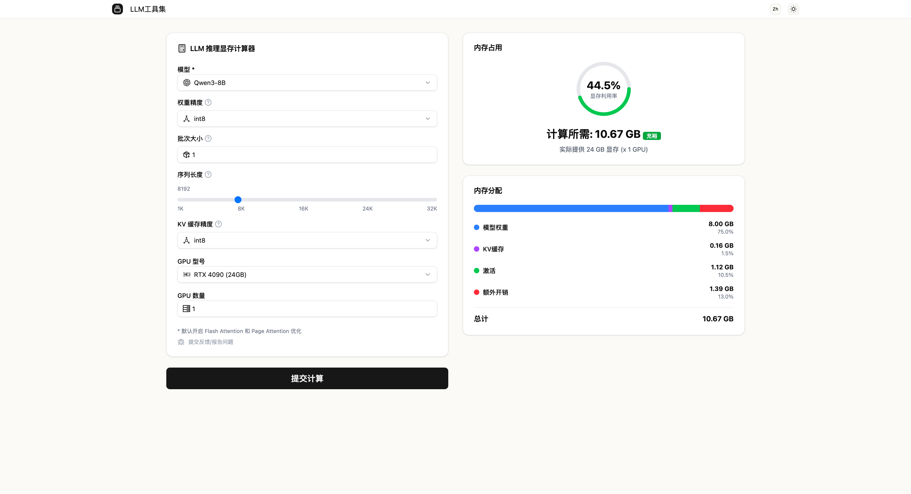

<div align="center">
  

  # 🛠️ LLM Toolset

  **为 LLM 开发者和研究人员打造的轻量级资源规划工具**

  [](https://opensource.org/licenses/MIT)
  [](https://www.python.org/downloads/)
  [](https://nodejs.org/)

  [在线体验](https://llmtoolset.amazingz.cloud/) · [报告 Bug](https://github.com/amazingchow/LLMToolset/issues) · [提出新功能](https://github.com/amazingchow/LLMToolset/issues)
</div>

---

## ✨ 为什么选择 LLM Toolset？

训练或部署一个大型语言模型，最头疼的问题是什么？**OOM (内存溢出)**。

本项目提供精确的内存需求估算工具，帮助你：
- ⚡ **避免资源浪费** - 准确预估所需显存，不再过度配置
- 🎯 **快速决策** - 快速判断模型是否能在现有硬件上运行
- 💰 **成本优化** - 合理规划 GPU 资源，降低云服务成本
- 📊 **多场景支持** - 覆盖训练、推理、量化等多种场景

## 🎯 核心特性

- **精确的内存估算** - 基于模型架构、精度、批次大小等参数精确计算
- **多精度支持** - FP32、FP16、BF16、INT8、INT4 全覆盖
- **训练与推理模式** - 分别计算不同场景下的内存需求
- **优化器状态计算** - 包含 Adam、AdamW 等优化器的额外开销
- **激活值估算** - 考虑前向传播中的中间激活值
- **可视化展示** - 清晰的图表展示内存分布

## 🚀 技术栈

**后端**
- Python 3.10+ (使用 `uv` 进行依赖管理)
- Flask / FastAPI
- 科学计算库 (NumPy, etc.)

**前端**
- Next.js 14+
- React 18+
- TypeScript
- Tailwind CSS

## 📖 使用示例

### 快速估算（经验法则）

如果只需要粗略估算，可以使用以下规则：

| 场景 | 公式 | 示例 |
|------|------|------|
| **推理** | `内存 ≈ 参数量 × 精度` | 7B 模型 × FP16 (2字节) ≈ 14GB |
| **训练** | `内存 ≈ 推理内存 × 4~6` | 14GB × 5 ≈ 70GB |

### 精确计算

内存需求计算器考虑以下因素：

| 因素 | 说明 | 影响 |
|------|------|------|
| **模型参数量** | 模型规模 (如 7B, 13B, 70B) | 基础内存占用 |
| **数据精度** | FP32 (4B) / FP16 (2B) / INT8 (1B) | 直接影响权重存储 |
| **批次大小** | 并行处理的样本数 | 影响激活值大小 |
| **序列长度** | 输入/输出文本最大长度 | 影响 KV Cache 和激活值 |
| **优化器状态** | Adam 等优化器的额外状态 | 训练时通常为参数的 2-3 倍 |
| **梯度** | 反向传播的梯度存储 | 等于参数大小 |
| **激活值** | 前向传播的中间结果 | 与层数、批次大小相关 |

### 📚 深入学习

推荐阅读：[大型语言模型训练与推理的内存需求](https://medium.com/@manuelescobar-dev/memory-requirements-for-llm-training-and-inference-97e4ab08091b)

## ⚡ 快速开始

### 在线体验（推荐）

无需安装，直接访问 [在线演示](https://llmtoolset.amazingz.cloud/) 立即使用。

### 本地部署

**环境要求**
- Git
- Python 3.10+
- Node.js 18+ (LTS)
- `uv` (Python 包管理器)

**一键启动**

```bash
# 1. 克隆项目
git clone https://github.com/amazingchow/LLMToolset.git
cd LLMToolset

# 2. 启动后端（终端 1）
cd backend
uv venv && uv sync  # 安装依赖
make dev            # 启动服务 (http://127.0.0.1:15050)

# 3. 启动前端（终端 2）
cd frontend
npm install         # 安装依赖
npm run dev         # 启动服务 (http://localhost:13031)
```

**访问应用**

打开浏览器访问 `http://localhost:13031`

### 使用流程

1. 选择模型（如 Qwen3-8B-Base）
2. 选择精度（FP32 / FP16 / BF16 / INT8 / INT4）
3. 设置批次大小和序列长度
4. 选择模式（推理/训练）
5. 点击"计算"查看结果

## 🤝 贡献指南

欢迎任何形式的贡献！

**参与方式**
- 🐛 提交 Bug 报告
- 💡 提出新功能建议
- 📝 改进文档
- 🔧 提交 Pull Request

**开发流程**
1. Fork 本项目
2. 创建特性分支 (`git checkout -b feature/AmazingFeature`)
3. 提交更改 (`git commit -m 'Add some AmazingFeature'`)
4. 推送到分支 (`git push origin feature/AmazingFeature`)
5. 开启 Pull Request

## 📝 常见问题

<details>
<summary><b>Q: 计算结果为什么与实际占用有差异？</b></summary>

A: 内存估算受多种因素影响：
- 框架开销（PyTorch/TensorFlow 等）
- 模型实现细节
- 编译优化
- 系统缓存

建议将估算结果作为参考，实际部署前进行测试。
</details>

<details>
<summary><b>Q: 支持哪些模型架构？</b></summary>

A: 目前主要支持 Transformer 架构的模型，包括：
- GPT 系列
- BERT 系列
- LLaMA / Qwen / Mistral 等
- T5 / BART 等

其他架构（如 Mamba）的支持正在开发中。
</details>

<details>
<summary><b>Q: 如何贡献新的模型配置？</b></summary>

A: 在 `backend/models/` 目录下添加 JSON 配置文件，包含模型参数量、层数等信息，然后提交 PR。
</details>

## ⚠️ 免责声明

本工具提供的是**估算值**，而非精确测量。实际内存使用受硬件、软件、配置等多种因素影响。生产环境部署前，请务必进行实际测试和性能分析。

## 📄 许可证

本项目基于 [MIT License](LICENSE) 开源。

---

<div align="center">
  如果这个项目对你有帮助，请给我们一个 ⭐️！
  <br>
  Made with ❤️ by <a href="https://github.com/amazingchow">@amazingchow</a>
</div>
